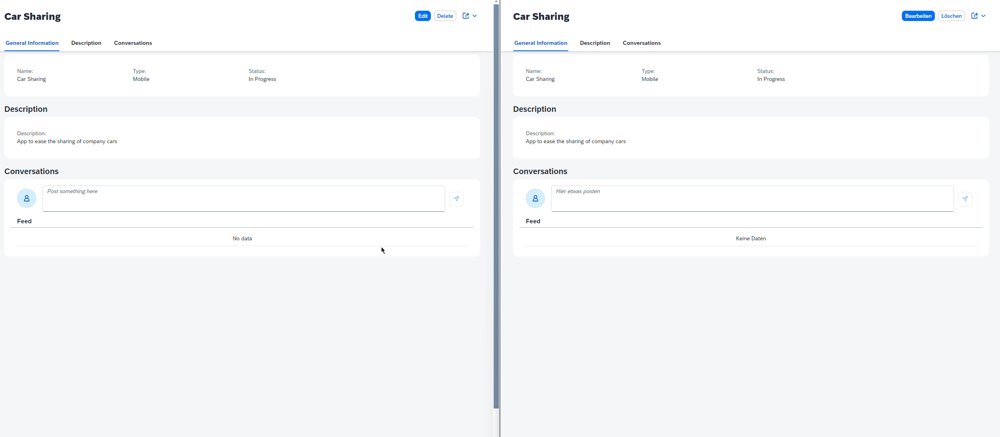

# Usage of cds plug-in `@cap-js-community/websocket`

> **Note**: Follow this [link](https://github.com/stockbal/cap-samples/tree/main) to show all available scenarios

Showcases a simple CAP application with a single Fiori Elements List report application that uses the [@cap-js-community/websocket](https://github.com/@cap-js-community/websocket) to update
a table on an object page, if modified by other users.

## Demo

Demonstrating the object page update via WebSocket communication and therefore having a rudimentary chat integrated into a Fiori Elements application.

