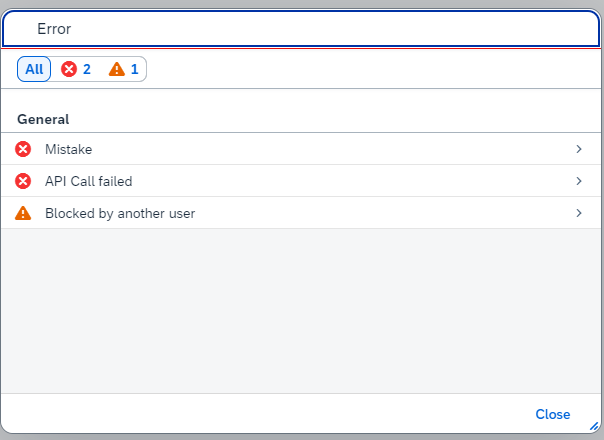
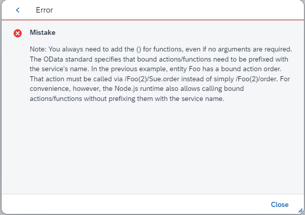

# Show service errors from CAP in Fiori Elements

> **Note**: Follow this [link](https://github.com/stockbal/cap-samples/tree/main) to show all available scenarios

Short documentation how to return detail errors or even long text errors via `req.error` in a CAP application, which are automatically shown in a [Message View](https://experience.sap.com/fiori-design-web/message-view/#message-details) of a Fiori Elements application.

## Information from Debugging UI5

The following provides a few insights into what attributes of a service message are passed to a message object that is later used in the MessageView control.

### Create Message from Service Error Message

The method `createUI5Message` is called when a message is produced during a call via the OData model.

See [ODataModel.createUI5Message](https://sapui5.hana.ondemand.com/1.124.0/resources/sap/ui/model/odata/v4/ODataModel-dbg.js)

```js
ODataModel.prototype.createUI5Message = function (oRawMessage, sResourcePath, sCachePath) {
    ...
        sMessageLongtextUrl = oRawMessage.longtextUrl,
    ...

    if (sMessageLongtextUrl && sResourcePath) {
        sMessageLongtextUrl = _Helper.makeAbsolute(sMessageLongtextUrl,
            this.sServiceUrl + sResourcePath);
    }

    return new Message({
        code : oRawMessage.code,
        descriptionUrl : sMessageLongtextUrl || undefined,
        message : oRawMessage.message,
        persistent : !bIsBound || oRawMessage.transition,
        processor : this,
        // Note: "" instead of undefined makes filtering easier (agreement with FE!)
        target : bIsBound ? aTargets : "",
        technical : oRawMessage.technical,
        technicalDetails : _Helper.createTechnicalDetails(oRawMessage),
        type : aMessageTypes[oRawMessage.numericSeverity] || MessageType.None
    });
};
```

## Message View retrieves Description via ajax call

If a `longtextUrl` has been provided in the message, an HTTP call will be performed to retrieve the text:

```js
var DEFAULT_ASYNC_HANDLERS = {
    asyncDescriptionHandler: function (config) {
        var sLongTextUrl = config.item.getLongtextUrl();
        if (sLongTextUrl) {
            jQuery.ajax({
                type: "GET",
                url: sLongTextUrl,
                success: function (data) {
                    config.item.setDescription(data);
                    config.promise.resolve();
                },
                error: function () {
                    var sError = "A request has failed for long text data. URL: " + sLongTextUrl;
                    Log.error(sError);
                    config.promise.reject(sError);
                }
            });
        }
    }
};
```

## Create actual error message from CAP

Now comes the interesting part, how to actually create detail or longtext errors from CAP application code.

### Create error in application code

```ts
const error = new Error("Mistake") as any;
error.code = 400;
/* details, can be filled with an error of messages
 * that are added after the main message in the message view
 */
error.details = [
{ message: "API Call failed", "@Common.numericSeverity": 4 },
{ message: "Blocked by another user", "@Common.numericSeverity": 3 }
];
// we can provide any URL that will return content of type text (NOT JSON)
error["@Common.longtextUrl"] = "http://docuUrl";

// finally we pass the created error to the req.error function
req.error(error);
```

To control the icon of the detail message we can use `@Common.numericSeverity` which will be translated into a message type for the message view

1. Success
2. Info
3. Warning
4. Error

> **Note**: This comes from a simple index to type mapping in `/sap/ui/model/odata/4/ODataModel`  
>
> ```js
>  aMessageTypes = [
>      undefined,
>      MessageType.Success,
>      MessageType.Information,
>      MessageType.Warning,
>      MessageType.Error
>  ],
> ```

### Sample of message view with error and 2 detail errors



### Create CAP `REST` Service to access documentation long text for UI

If the longtext documentation should be provided by the CAP application, we have to think a little bit outside the box. Unfortunately one cannot just create an action in an OData service that returns content type `text` which is expected by the UI5 framework (see chapter above about the Message View).

Luckily we have the option to also create plain `REST` services with the CAP framework.

#### REST service definition

```cds
@rest
@path: '/docs'
service DocumentationService {
    function read(id : String) returns String;
}
```

#### Service Implemenation

```ts
import { ApplicationService } from "@sap/cds";
import { read } from "#cds-models/DocumentationService";

export default class DocumentationService extends ApplicationService {
  async init() {
    this.on(read, async (req) => {
      // manually set the content via the response object
      req.http?.res.header("Content-Type", "text/plain");
      // TODO: retrieve documentation according to id or other parameters ....
      // Pass a sample string to see if it works
      req.http?.res.send(
        "Note: You always need to add the () for functions, even if no arguments are required. The OData standard specifies that bound actions/functions need to be prefixed with the service's name. In the previous example, entity Foo has a bound action order. That action must be called via /Foo(2)/Sue.order instead of simply /Foo(2)/order. For convenience, however, the Node.js runtime also allows calling bound actions/functions without prefixing them with the service name."
      );
    });
    return super.init();
  }
}
```

Locally this approach can be tested quite easily. We just set the `longtextUrl` to the service URL at root:

```ts
error["@Common.longtextUrl"] = "/docs/docs(id='i')";
```

With a standalone [approuter](https://www.npmjs.com/package/@sap/approuter) this should work easily. From a deployed application it may need some tweaking, maybe via a relative path. If the Fiori Elements application is using a service at path `/odata/v4/bookshop`, we should be able to reach the docs service via

```ts
error["@Common.longtextUrl"] = "../../../docs/docs(id='i')";
```

#### Sample of longtext in message view

